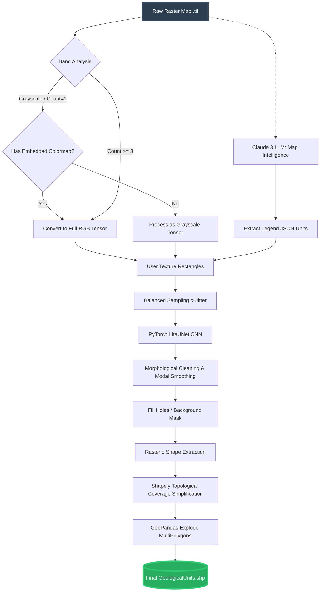

# GeoVector: Architectural Flow

The GeoVector system combines Computer Vision, Large Language Models, and advanced GIS Topological geometry processing to automate Map Digitization.

```mermaid
graph TD
    %% Input Layer
    A[Raw Raster Map .tif]:::input --> B{Band Analysis}
    
    %% Color Processing Layer
    B -->|Grayscale / Count=1| C{Has Embedded Colormap?}
    C -->|Yes| D[Convert to Full RGB Tensor]
    C -->|No| E[Process as Grayscale Tensor]
    B -->|Count >= 3| D
    
    %% AI Parsing Layer
    A -.-> F[Claude 3 LLM: Map Intelligence]
    F --> G[Extract Legend JSON Units]
    
    %% Deep Learning Layer
    D --> H[User Texture Rectangles]
    E --> H
    G --> H
    
    H --> I[Balanced Sampling & Jitter]
    I --> J[PyTorch LiteUNet CNN]
    
    %% Post-Processing Layer
    J --> K[Morphological Cleaning & Modal Smoothing]
    K --> L[Fill Holes / Background Mask]
    
    %% GIS Vectorization Layer
    L --> M[Rasterio Shape Extraction]
    M --> N[Shapely Topological Coverage Simplification]
    N --> O[GeoPandas Explode MultiPolygons]
    O --> P[(Final GeologicalUnits.shp)]:::output
    
    classDef input fill:#2c3e50,stroke:#34495e,stroke-width:4px,color:#fff;
    classDef output fill:#27ae60,stroke:#2ecc71,stroke-width:4px,color:#fff;
```
